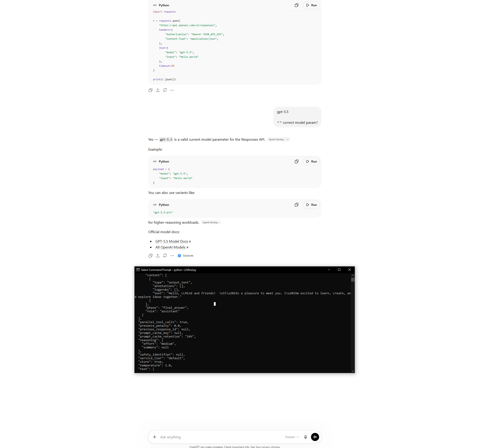

<p align="center">
  
</p>

<h1 align="center">LLMind</h1>

<p align="center">
  <b>An LLM-powered CLI with agentic hooks for the operating system.</b><br/>
  <i>Windows-first · Python · Multi-provider (OpenAI · Anthropic · Gemini · xAI)</i>
</p>

<p align="center">
  
  
  
</p>

---

## Overview

**LLMind** is a command-line tool that lets you talk to large language models and let them safely *act on your machine*. It ships with a registry of **agentic hooks** — filesystem, registry, process-launch, and UI-automation primitives — that LLM responses can invoke as tool calls. Think of it as a minimal, transparent agent runtime for Windows that you can read end-to-end.

It is designed as a **template you can extend**: clear modules, explicit guardrails (UI actions are off by default), an on-disk cache for API keys and resolved executables, and a JSON-based hook schema you can wire up to any provider.

## Features

- 🧠 **Multi-provider LLM client** — OpenAI (chat + images), Anthropic, Google Gemini, and xAI. Models are fetched live from each provider's API.
- 🔌 **Agentic hook registry** — built-in hooks for filesystem access, HKCU registry settings, process launch, and Windows UI automation, all defined via JSON schemas.
- 🛡️ **Safe-by-default guardrails** — UI/launch/command/workflow hooks are gated by environment flags and allowlists; invalid actions are rejected before execution.
- 🗝️ **Multi-key API manager** — store, label, mask, and switch between multiple provider keys; import from file or paste manually.
- 📦 **AppData-backed cache** — API keys, resolved executable paths, and settings are persisted under `%APPDATA%\LLMind` (or `~/.config/LLMind` elsewhere).
- 🧪 **Self-test mode** — built-in checks for filesystem, registry, and UI hooks so you can verify the runtime before you trust it.
- 🧬 **Persistent hook code generator** — export validated hooks as a standalone Python module for reuse outside the CLI.
- 🖼️ **Artifact handling** — automatically extracts and saves binary artifacts (e.g. generated images) returned in LLM responses.

## Repository layout

```
LLMind/
├── main/
│   ├── LLMind.py          # CLI entry point (LLMindCLI)
│   └── ARGS.cmd           # Example scripted run (xAI / grok-4.3)
├── hooks/
│   ├── hook_registry.py   # Built-in hooks + execution engine
│   ├── hook_schemas.py    # JSON schemas for tool calls
│   ├── provider_adapters.py
│   └── generated/         # Output of the persistent hook generator
├── network/               # Provider clients + request payload builders
├── response/              # Response parsing & artifact extraction
├── cache/                 # On-disk cache helpers
├── appdata/               # AppData layout helpers
├── scripts/               # Standalone utility scripts
├── utils/
└── .env.example
```

## Requirements

- **Windows 10 or 11** (other OSes run in degraded mode — UI hooks are Windows-only)
- **Python 3.10+**
- An API key from at least one of: OpenAI, Anthropic, Google Gemini, or xAI

## Installation

```cmd
git clone https://github.com/em157/LLMind.git
cd LLMind
python -m venv .venv
.venv\Scripts\activate
pip install -r requirements.txt   :: if present; otherwise install deps as needed
copy .env.example .env
```

Edit `.env` and set at minimum `OPENAI_API_KEY` (or paste keys in-app later) and `PYTHON_EXE` if `python` is not on your `PATH`.

## Quick start

### Interactive mode

```cmd
python main\LLMind.py
```

You'll be dropped into the main menu:

```
Main Menu
  b - API key manager
  1 - Show status
  2 - Test API request
  3 - Run Windows OS hook self-test
  4 - Generate persistent hook code
  5 - Refresh executable scan/PATH cache
  q - Quit
```

1. Press `b` to add an API key (paste it or import from a file).
2. Press `2` to send a request — enter a provider URL (e.g. `https://api.openai.com/v1/chat/completions`) and LLMind will fetch the model list, build the right payload format, and execute any tool calls in the response.
3. Press `3` to run the built-in hook self-test before granting the agent UI control.

### Scripted mode

`main\ARGS.cmd` pipes a canned menu sequence into `LLMind.py` — useful for smoke tests and as a template for your own automation:

```cmd
main\ARGS.cmd
```

The bundled example targets xAI's `grok-4.3` and asks it to *"Open 4 windows notepads and arrange them visibly on the screen."*

### Prompt workflow (run, share, commit)

Use the helper command to run prompt files against any supported provider, export a shareable zip bundle, and commit prompt updates safely from a feature branch.

```cmd
main\PROMPT_WORKFLOW.cmd -Action run -Provider xai -PromptFile prompts\PROMPT_1_WINDOWS_UI_TRIAGE.md -KeyIndex 2
main\PROMPT_WORKFLOW.cmd -Action share
main\PROMPT_WORKFLOW.cmd -Action commit -CommitMessage "Update provider prompt pack"
```

Details and additional flags are documented in `prompts/WORKFLOW.md`.

### Prompt pack additions

The `prompts/` folder now includes a practical progression from focused diagnostics to full multi-step automation:

- `PROMPT_1_WINDOWS_UI_TRIAGE.md` - baseline Windows UI troubleshooting flow
- `PROMPT_2_BROWSER_VERIFY.md` - browser verification and evidence capture
- `PROMPT_3_DIAGNOSTICS_AND_EMAIL.md` - diagnostics + optional notification flow
- `PROMPT_4_UI_OCR_NETWORK_PLAYBOOK.md` - combined UI actions, screenshots, OCR-style validation, and network checks
- `PROMPT_5_BICYCLE_CALI_IMAGE_COLLECTION.md` - web parsing + remote file download pipeline with manifest/report outputs
- `PROMPT_6_UI_OCR_INTERACTIVE_CHECKIN.md` - interactive WordPad/Notepad check-in scenario with OCR-style token checks
- `PROMPT_7_EFFICIENT_FULL_TOOLCHAIN_PLAYBOOK.md` - compact "use every reasonable tool" workflow with strict success criteria

### Prompt flow execution model

`main/PROMPT_WORKFLOW.cmd` and `scripts/prompt_workflow.ps1` provide a repeatable execution path for prompt files:

1. Resolve provider, key index, model, and prompt file inputs.
2. Feed the prompt into `main/LLMind.py` using scripted menu automation.
3. Execute model tool calls through hook schemas in `hooks/hook_schemas.py` and runtime logic in `hooks/hook_registry.py`.
4. Persist artifacts and outputs under `%APPDATA%\\LLMind` (screenshots, reports, manifests, and related files).
5. Optionally package prompt updates with `-Action share` and create a scoped commit with `-Action commit`.

This flow keeps prompt runs reproducible while still allowing provider/model swaps per run.

## Configuration

All settings can be provided via `.env` or real environment variables.

| Variable | Purpose | Default |
| --- | --- | --- |
| `OPENAI_API_KEY` | OpenAI key (other providers use the in-app manager) | — |
| `PYTHON_EXE` | Python interpreter used by `ARGS.cmd` | `python` |
| `LLMIND_BASE_DIR` / `LLMIND_SOURCE_FILE` / `LLMIND_DEST_DIR` | Optional paths consumed by hooks | — |
| `LLMIND_ENABLE_UI_HOOKS` | Allow Windows UI automation hooks | `1` |
| `LLMIND_ENABLE_LAUNCH_HOOKS` | Allow process-launch hooks | `1` |
| `LLMIND_ENABLE_COMMAND_HOOKS` | Allow shell-command hooks | `1` |
| `LLMIND_ENABLE_WORKFLOW_HOOKS` | Allow multi-step workflow hooks | `1` |
| `LLMIND_ENABLE_EMAIL_HOOKS` | Allow outbound email hooks | `0` |
| `LLMIND_SMTP_HOST` / `_PORT` / `_USER` / `_PASSWORD` / `_FROM` / `_TLS` | SMTP settings for the email hook | — |

Set any `LLMIND_ENABLE_*` flag to `0` to disable that category of hook entirely.

## Hooks

Hooks are the bridge between the LLM and your machine. Each hook has a JSON schema (see `hooks/hook_schemas.py`) so providers can call them as tools. Built-in hooks include:

- `filesystem_access` — sandboxed read/write/delete inside AppData
- `registry_settings` — read/write under `HKCU`
- `windows_ui_action` — find/focus/move/resize visible windows (allowlisted actions only)
- `launch_process` — start known executables resolved against the cached PATH

To export a self-contained Python module containing your selected hooks:

```
> 4   # "Generate persistent hook code" in the main menu
```

The generated module is written to `hooks/generated/persistent_hooks.py` by default.

## Safety & guardrails

- UI and process actions are **always gated** by an `allow_ui_actions` context flag and an action allowlist; unknown actions are rejected with `unsupported action`.
- API keys are stored locally in `%APPDATA%\LLMind\api_cache.json` and are **masked** whenever displayed.
- Artifacts written to disk are stored under sanitized filenames with a SHA-256 fingerprint to prevent path traversal.
- Executable resolution uses a bounded scan (`max_depth=4`, `max_hits=5`) over `Program Files`, `Program Files (x86)`, and `LOCALAPPDATA`.

## PII & secret hygiene

- Never commit real API keys, bearer tokens, or key-cache artifacts.
- Keep local secrets in `.env` only; `.env` is ignored and `.env.example` is a placeholder template.
- Avoid hardcoding personal absolute paths (for example: `C:\\Users\\<name>\\...` or `/Users/<name>/...`) in committed scripts/docs.
- Local virtual environments (`.venv/`, `.venv-1/`) and local key-cache artifacts (`AQ.*`) are ignored to reduce accidental leakage.
- Run `pre-commit run --all-files` before pushing. The repo includes checks for hardcoded personal absolute paths and common secret patterns.

## Additional documentation

- [`COMPUTER_VISION_ADAPTATION_GUIDE.md`](COMPUTER_VISION_ADAPTATION_GUIDE.md) — adapting LLMind for vision workflows
- [`VOICE_STT_AUDIO_TEMPLATE.md`](VOICE_STT_AUDIO_TEMPLATE.md) — voice / STT / audio integration template

## Contributing

Issues and pull requests are welcome. Please run the hook self-test (`menu option 3`) and `pre-commit run --all-files` (see `.pre-commit-config.yaml`) before opening a PR.

## License

No license file is currently included in this repository. Until one is added, all rights are reserved by the author. If you'd like to use LLMind in your own project, please open an issue to discuss.
